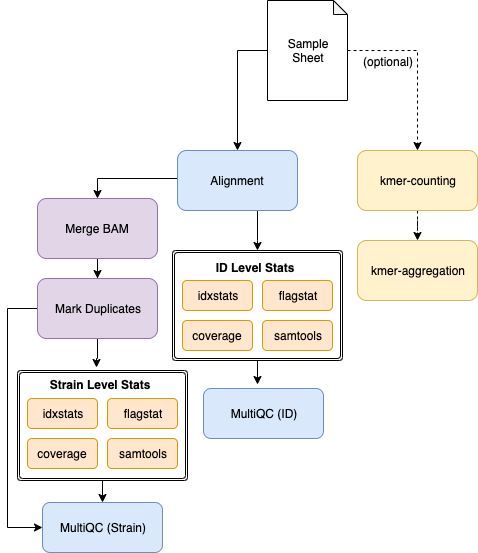

# alignment-nf

The [alignment-nf](https://github.com/AndersenLab/alignment-nf) pipeline performs alignment for wild isolate sequence data __at the strain level__, and outputs BAMs and related information. Those BAMs can be used for downstream analysis including variant calling, [concordance analysis](http://andersenlab.org/dry-guide/pipeline-concordance/), [wi-nf (variant calling)](http://andersenlab.org/dry-guide/pipeline-wi/) and other analyses.

!!! Note
    Historically, sequence processing was performed at the isotype level. We are still interested in filtering strains used in analysis at the isotype level, but alignment and variant calling are now performed at the strain level rather than at the isotype level.

[TOC]

## Usage
```

             ▗▖ ▝▜   ▝                       ▗      ▗▖ ▖▗▄▄▖
             ▐▌  ▐  ▗▄   ▄▄ ▗▗▖ ▗▄▄  ▄▖ ▗▗▖ ▗▟▄     ▐▚ ▌▐
             ▌▐  ▐   ▐  ▐▘▜ ▐▘▐ ▐▐▐ ▐▘▐ ▐▘▐  ▐      ▐▐▖▌▐▄▄▖
             ▙▟  ▐   ▐  ▐ ▐ ▐ ▐ ▐▐▐ ▐▀▀ ▐ ▐  ▐   ▀▘ ▐ ▌▌▐
            ▐  ▌ ▝▄ ▗▟▄ ▝▙▜ ▐ ▐ ▐▐▐ ▝▙▞ ▐ ▐  ▝▄     ▐ ▐▌▐
                         ▖▐
                         ▝▘
    parameters              description                    Set/Default
    ==========              ===========                    ========================
    --debug                 Set to 'true' to test          ${params.debug}
    --sample_sheet          sample_sheet                   ${params.sample_sheet}
    --fq_prefix             fastq prefix                   ${params.fq_prefix}
    --kmers                 count kmers                    ${params.kmers}
    --reference             Reference Genome (w/ .gz)      ${params.reference}
    --output                Location for output            ${params.output}
    --email                 Email to be sent results       ${params.email}

    HELP: http://andersenlab.org/dry-guide/pipeline-alignment/
```

## Pipeline Overview



# Usage

## Quick Start

The pipeline can be run using the following command:

```
NXF_VER=19.09.0-edge nextflow run main.nf -profile local
```

## Profiles and Running the Pipeline

There are three configuration profiles for this pipeline.

* `local` - Used for local development.
* `quest` - Used for running on Quest.
* `gcp` - For running on Google Cloud.

## Software

Almost all processes within the pipeline are now managed using [conda](). To use the pipeline, you must have `conda` installed and available. Nextflow will take care of installing conda environments and managing software.

!!! note
       
       [mosdepth](https://www.github.com/brentp/mosdepth) is used to calculate coverage. `mosdepth` is available on Linux machines, but not on Mac OSX. That is why the conda environment for the `coverage` process is specified as `conda { System.properties['os.name'] != "Mac OS X" ? 'bioconda::mosdepth=0.2.6' : "" }`. This snippet allows mosdepth to run off the executable present in the `bin` folder locally on Mac OSX, or use the conda-based installation when on Linux.

# Parameters

## --debug

You should use `--debug true` for testing/debugging purposes. This will run the debug test set (located in the `test_data` folder) using your specified configuration profile (e.g. local / quest / gcp).

For example:

```
nextflow run main.nf -profile local --debug -resume
```

Using `--debug` will automatically set the sample sheet to `test_data/sample_sheet.tsv`

## --sample_sheet

Below is a summary of the sample sheet. Please see [sample_sheet](/sample-sheets) for more information.

The sample sheet specifies the FASTQs and associated metadata required for alignment. An example sample sheet is bundled with the test data (`test_data/sample_sheet.tsv`). The first few lines look like this:

| strain |   reference_strain |    isotype | id |  lb |  fq1 | fq2 | seq_folder    |                                              |
|:------|------|----------|--|--|--|--|--|--------------------------------------------------------------------------|
| AB1  | FALSE |   ISO1 |    BGI1-RET2-AB1 |   RET2 |    BGI1-RET2-AB1-trim-1P.fq.gz |BGI1-RET2-AB1-trim-2P.fq.gz | original_wi_set |
| ECA243 |   TRUE |   ISO1 |    BGI3-RET3b-ECA243 |   RET3b |   BGI3-RET3b-ECA243-trim-1P.fq.gz                                  | BGI3-RET3b-ECA243-trim-2P.fq.gz  | original_wi_set


The only required columns for running are:

* __strain__ - the name of the strain
* __id__ - A unique ID for each sequencing run.
* __lb__ - A library ID.
* __fq1__ - The path to FASTQ1
* __fq2__ - The path to FASTQ2

The alignment pipeline will merge multiple sequencing runs of the same strain into a single bam. However, summary output is provided at both the `strain` and `id` level. In this way, if there is a poor sequencing run it can be identified and removed from a collection of sequencing runs belonging to a strain.

When using `--debug true`, the `test_data/sample_sheet.tsv` file is used.

!!! Note
    Previously this option was specified using `--fqs`.

## --fq_prefix

Within a sample sheet you may specify the locations of FASTQs using an absolute directory or a relative directory. If you want to use a relative directory, you should use the `--fq_prefix` to set the path that should be prefixed to each FASTQ.

!!! Note
    Previously, this option was `--fqs_file_prefix`
## --kmers

__default__ = true

Toggles kmer-analysis

## --reference

A fasta reference indexed with BWA. WS245 is packaged with the pipeline for convenience when testing or running locally.

On Quest, the reference is available here:

```
/projects/b1059/data/genomes/c_elegans/WS245/WS245.fa.gz
```

## --output

__Default__ - `Alignment-YYYYMMDD`

A directory in which to output results. If you have set `--debug true`, the default output directory will be `alignment-YYYYMMDD-debug`.

## --email

Setting `--email` will trigger an email report following pipeline execution.

# Output

## Strain

```
├── _aggregate
│   ├── kmers.tsv
│   └── multiqc
│       ├── id_data/
│       │   ├── ... (same as strain_data/)
│       ├── id_multiqc_report.html
│       ├── strain_data/
│       │   ├── mqc_mosdepth-coverage-dist-id_1.txt
│       │   ├── mqc_mosdepth-coverage-per-contig_1.txt
│       │   ├── mqc_mosdepth-coverage-plot-id_1.txt
│       │   ├── mqc_picard_deduplication_1.txt
│       │   ├── mqc_samtools-idxstats-mapped-reads-plot_Counts.txt
│       │   ├── mqc_samtools-idxstats-mapped-reads-plot_Normalised_Counts.txt
│       │   ├── mqc_samtools_alignment_plot_1.txt
│       │   ├── multiqc.log
│       │   ├── multiqc_data.json
│       │   ├── multiqc_general_stats.txt
│       │   ├── multiqc_picard_dups.txt
│       │   ├── multiqc_qualimap_bamqc_genome_results.txt
│       │   ├── multiqc_samtools_flagstat.txt
│       │   ├── multiqc_samtools_idxstats.txt
│       │   ├── multiqc_samtools_stats.txt
│       │   └── multiqc_sources.txt
│       └── strain_multiqc_report.html
├── bam
│   ├── [strain].bam
│   └── [strain].bam.bai
├── coverage
│   ├── id
│   │   ├── [id].mosdepth.global.dist.txt
│   │   ├── [id].mosdepth.summary.txt
│   │   ├── [id].per-base.bed.gz
│   │   └── [id].per-base.bed.gz.csi
│   └── strain
│       ├── [strain].mosdepth.global.dist.txt
│       ├── [strain].mosdepth.summary.txt
│       ├── [strain].per-base.bed.gz
│       └── [strain].per-base.bed.gz.csi
├── software_versions.txt
└── summary.txt
```

Most files should be obvious. A few are detailed below.

* __software_versions.txt__ - Outputs the fosftware versions used for every process (step) of the pipeline.
* __summary.txt__ - Outputs a summary of the parameters used.
* __aggregate__ - Stores data that has been aggregated across all strains or sequencing IDs. 
* __coverage__ - Contains coverage data at the strain or id level, presented in a variety of ways.


