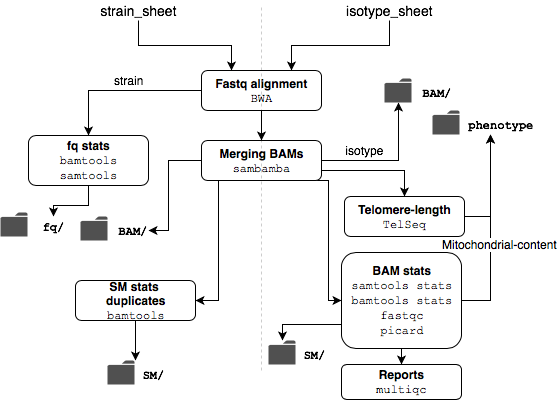

# alignment-nf

The [alignment-nf](https://github.com/AndersenLab/alignment-nf) pipeline performs alignment for wild isolate sequence data __at the strain level__, and outputs BAMs and related information. Those BAMs can be used for downstream analysis of [concordance-nf](http://andersenlab.org/dry-guide/pipeline-concordance/), [wi-nf](http://andersenlab.org/dry-guide/pipeline-wi/) and variants calling.

Note that historically, sequence processing was previously performed at the isotype level. We are still interested in filtering strains used in analysis at the isotype level, but alignment and variant calling are now performed at the strain level rather than at the isotype level.

[TOC]

## Usage
```
             ▗▖ ▝▜   ▝                       ▗      ▗▖ ▖▗▄▄▖
             ▐▌  ▐  ▗▄   ▄▄ ▗▗▖ ▗▄▄  ▄▖ ▗▗▖ ▗▟▄     ▐▚ ▌▐
             ▌▐  ▐   ▐  ▐▘▜ ▐▘▐ ▐▐▐ ▐▘▐ ▐▘▐  ▐      ▐▐▖▌▐▄▄▖
             ▙▟  ▐   ▐  ▐ ▐ ▐ ▐ ▐▐▐ ▐▀▀ ▐ ▐  ▐   ▀▘ ▐ ▌▌▐
            ▐  ▌ ▝▄ ▗▟▄ ▝▙▜ ▐ ▐ ▐▐▐ ▝▙▞ ▐ ▐  ▝▄     ▐ ▐▌▐
                         ▖▐
                         ▝▘
    parameters              description                    Set/Default
    ==========              ===========                    ========================
    --debug                 Set to 'true' to test          ${params.debug}
    --fqs                   fastq file (see help)          ${params.fqs}
    --fq_file_prefix        fastq prefix                   ${params.fq_file_prefix}
    --reference             Reference Genome (w/ .gz)      ${params.reference}
    --output                Location for output            ${params.output}
    --email                 Email to be sent results       ${params.email}

    HELP: http://andersenlab.org/dry-guide/pipeline-alignment/
```

## Pipeline Overview



# Usage

## Quick Start

The pipeline can be run using the following command:

```
NXF_VER=19.09.0-edge nextflow run main.nf -profile local
```

## Profiles and Running the Pipeline

There are three configuration profiles for this pipeline.

* `local` - Used for local development.
* `quest` - Used for running on Quest.
* `gcp` - For running on Google Cloud.

## Software

Almost all processes within the pipeline are now managed using [conda](). To use the pipeline, you must have `conda` installed and available. Nextflow will take care of installing conda environments and managing software.

!!! note
       
       [mosdepth](https://www.github.com/brentp/mosdepth) is used to calculate coverage. `mosdepth` is available on Linux machines, but not on Mac OSX. That is why the conda environment for the `coverage` process is specified as `conda { System.properties['os.name'] != "Mac OS X" ? 'bioconda::mosdepth=0.2.6' : "" }`. This snippet allows mosdepth to run off the version present in the `bin` folder locally on Mac OSX, or using the conda-managed installation on a Linux Machine.

## Debugging

You should use `--debug true` for testing/debugging purposes. This will run the debug test set using your specified config.

This can be used locally or on quest. For example:

```
nextflow run main.nf -profile quest_debug -resume --goal "strain"
```

## --output

A directory in which to output results. By default it will be `alignment-YYYY-MM-DD` where YYYY-MM-DD is todays date. If you have set `--debug true`, it will take the form of `alignment-YYYY-MM-DD-debug`.

## --fqs (FASTQs)

When running the `alignment-nf` pipeline you must provide a sample sheet that tells it where fastqs are and which samples group into strains/isotypes. By default, this is the sample sheet in the base of the alignment-nf repo , but can be specified using `--fqs` if an alternative is required. The sample sheet provides information on the strain/isotype, fastq_pairs, library, location of fastqs, and sequencing folder. See [Sample Sheet](# Sample Sheet) for more details on how it is generated.

When using `--debug true`, the `test_data/sample_sheet.tsv` file is used.

## --fqs_file_prefix

A prefix path for FASTQs defined in a sample sheet. The sample sheet designed for usage on Quest (`SM_sample_sheet.tsv`) uses absolute paths so no FASTQ prefix is necessary. Additionally, there is no need to set this option as it is set for you when using the `-profile` flag. This option is only necessary (maybe) with a custom dataset where you are not using absolute paths to reference FASTQs.

## --reference

A fasta reference indexed with BWA. This is packaged with the repo for convenience for running locally.

On Quest, the reference is available here:

```
/projects/b1059/data/genomes/c_elegans/WS245/WS245.fa.gz
```

## --email

Enable a email notification when you use this params.

# Sample Sheet

A sample sheet is the only acceptable input style for sequences in this pipeline. Sample sheet should be constructed by using the scripts under `scripts` folder, or follow the format in [Sample Sheets](http://andersenlab.org/dry-guide/sample-sheets/).

!!! note
       
       If you don't use `--fqs` to specify the directory of sample sheet, you should put sample sheet in the root of this repo. The name structure is restricted as `SM_strain_sheet.tsv` or `SM_isotype_sheet.tsv`.
   
# Output

## Strain

When you use `--goal "strain"`

```
├── BAM
│   ├── WN2065.bam
│   └── WN2065.bam.bai
├── fq
│   ├── fq_bam_idxstats.tsv
│   ├── fq_bam_stats.tsv
│   ├── fq_coverage.full.tsv
│   └── fq_coverage.tsv
├── log.txt
└── SM
    ├── bam_duplicates.tsv
    ├── SM_bam_idxstats.tsv
    ├── SM_bam_stats.tsv
    ├── SM_coverage.full.tsv
    ├── SM_coverage.mb.tsv.gz
    └── SM_coverage.tsv
```

* __log.txt__ - A summary of nextflow run.
* __BAM__ - BAMs for strains are included in this folder.
* __fq__ - The coverage and BAMs information for each sample were included here.
* __SM__ - The coverage and BAMs information for each strain, samples come from the same strain were merged and presented here.

## Isotype

When you use `--goal "isotype"`

```
├── BAM
│   ├── RC301.bam
│   └── RC301.bam.bai
├── log.txt
├── phenotype
│   ├── MT_content.tsv
│   └── telseq.tsv
├── report
│   ├── multiqc_data
│   │   ├── multiqc_data.json
│   │   ├── multiqc_fastqc.json
│   │   ├── multiqc_general_stats.json
│   │   ├── multiqc_picard_AlignmentSummaryMetrics.json
│   │   ├── multiqc_picard_insertSize.json
│   │   ├── multiqc_samtools_idxstats.json
│   │   ├── multiqc_samtools_stats.json
│   │   └── multiqc_sources.json
│   └── multiqc.html
└── SM
    ├── isotype_bam_idxstats.tsv
    ├── isotype_bam_stats.tsv
    ├── isotype_coverage.full.tsv
    └── isotype_coverage.tsv
```

* __log.txt__ - A summary of nextflow run.
* __BAM__ - BAMs for isotype are included in this folder.
* __phenotype__ - Mitochondrial content and Telomere length for each isotype.
* __SM__ - Alignment statistics by isotype, samples come from the same isotype were merged.
* __report__ - A comprehensive report of isotype BAMs.

